<div align="center">

# 🫙 Truthjar

**免費線上真心話大冒險遊戲 | Truth or Dare Party Game**

[](https://truthjar-3202f.web.app)
[](https://github.com/bolin8017/truthjar/releases)
[](./LICENSE)

[](https://firebase.google.com/)
[](https://react.dev/)
[](https://mui.com/)
[](https://vitejs.dev/)

專為聚會設計的即時多人真心話大冒險遊戲 🎉

[🎮 立即體驗](https://truthjar-3202f.web.app) · [📖 查看文件](#安裝步驟) · [🐛 回報問題](https://github.com/bolin8017/truthjar/issues)

</div>

---

## ✨ 功能特色

<table>
<tr>
<td width="50%">

### 🏠 房間制系統
創建房間，分享代碼或 QR Code 讓朋友快速加入

### 🎭 匿名出題
出題者身份保密，讓遊戲更加刺激有趣

### 🎲 隨機抽取
隨機抽人、隨機抽題，命運由天決定

</td>
<td width="50%">

### ⚡ 即時同步
基於 Firebase Realtime Database 的多人連線，畫面即時更新

### 📱 跨平台支援
響應式設計，支援桌面、平板、手機

### 💰 完全免費
無廣告、無付費牆、開源透明

</td>
</tr>
</table>

## 🎮 遊戲流程

```mermaid
graph LR
    A[創建房間] --> B[分享 QR Code]
    B --> C[玩家加入]
    C --> D[開始遊戲]
    D --> E[隨機抽人]
    E --> F[選擇真心話/大冒險]
    F --> G[其他玩家出題]
    G --> H[抽題執行]
    H --> E
```



1. 🎯 房主創建房間，分享房間代碼或 QR Code
2. 👥 玩家輸入代碼或掃描 QR Code 加入
3. 🚀 房主按下「開始遊戲」
4. 🎰 系統隨機抽出一位玩家
5. 🤔 被抽中的人選擇「真心話」或「大冒險」
6. ✍️ 其他玩家匿名出題（題目會累積到個人題庫）
7. 🎲 被抽中的人從題庫抽一題執行
8. 🔄 完成後抽下一位，循環遊戲

## 🚀 快速開始

### 📺 線上體驗

直接訪問 **[https://truthjar-3202f.web.app](https://truthjar-3202f.web.app)** 立即開始遊戲！

### 💻 本地開發

#### 前置需求

- [Node.js](https://nodejs.org/) 20+ （建議使用 [nvm](https://github.com/nvm-sh/nvm)）
- [Firebase](https://firebase.google.com/) 帳號

#### 安裝步驟

1. **Clone 專案**

```bash
git clone https://github.com/bolin8017/truthjar.git
cd truthjar
```

2. **使用正確的 Node 版本**

```bash
nvm use
```

3. **安裝依賴**

```bash
npm install
```

4. **設定 Firebase**

   - 前往 [Firebase Console](https://console.firebase.google.com/) 創建專案
   - 啟用 **Anonymous Authentication**
   - 創建 **Realtime Database**（選擇測試模式）
   - 前往 **Project Settings** > **General** 複製 Firebase 配置

5. **創建環境變數**

```bash
cp .env.example .env.local
```

編輯 `.env.local` 填入你的 Firebase 配置：

```env
VITE_FIREBASE_API_KEY=your-api-key
VITE_FIREBASE_AUTH_DOMAIN=your-project.firebaseapp.com
VITE_FIREBASE_DATABASE_URL=https://your-project-default-rtdb.firebaseio.com
VITE_FIREBASE_PROJECT_ID=your-project-id
VITE_FIREBASE_STORAGE_BUCKET=your-project.appspot.com
VITE_FIREBASE_MESSAGING_SENDER_ID=your-sender-id
VITE_FIREBASE_APP_ID=your-app-id
```

6. **部署資料庫規則**

```bash
firebase deploy --only database
```

7. **啟動開發伺服器**

```bash
npm run dev
```

開啟 http://localhost:5173 開始開發！🎉

#### 部署到 Firebase Hosting

```bash
npm run build
firebase deploy --only hosting
```

## 🛠️ 技術棧

| 類別 | 技術 |
|------|------|
| **前端框架** | [React 18](https://react.dev/) |
| **UI 框架** | [Material-UI v7](https://mui.com/) |
| **路由** | [React Router v7](https://reactrouter.com/) |
| **狀態管理** | React Hooks |
| **後端服務** | [Firebase Realtime Database](https://firebase.google.com/products/realtime-database) |
| **身份驗證** | [Firebase Anonymous Auth](https://firebase.google.com/docs/auth/web/anonymous-auth) |
| **託管** | [Firebase Hosting](https://firebase.google.com/products/hosting) |
| **構建工具** | [Vite](https://vitejs.dev/) |
| **QR Code** | [qrcode.react](https://www.npmjs.com/package/qrcode.react) |
| **程式碼風格** | [ESLint](https://eslint.org/) + [Prettier](https://prettier.io/) |

## 📁 專案結構

```
truthjar/
├── src/
│   ├── components/       # React 組件
│   │   ├── ChoiceSelector.jsx
│   │   ├── CreateRoomForm.jsx
│   │   ├── JoinRoomForm.jsx
│   │   ├── PlayerDrawing.jsx
│   │   ├── PlayerList.jsx
│   │   ├── QuestionDrawing.jsx
│   │   ├── QuestionForm.jsx
│   │   ├── QuickJoinForm.jsx
│   │   └── RoomLobby.jsx
│   ├── hooks/           # 自定義 Hooks
│   │   ├── useAuth.js
│   │   └── useRoom.js
│   ├── pages/           # 頁面組件
│   │   ├── HomePage.jsx
│   │   └── RoomPage.jsx
│   ├── services/        # Firebase 服務
│   │   ├── firebase.js
│   │   └── roomService.js
│   ├── utils/           # 工具函數
│   │   └── roomCode.js
│   ├── App.jsx          # 主應用組件
│   ├── main.jsx         # 入口文件
│   └── theme.js         # MUI 主題配置
├── database.rules.json  # Firebase 資料庫規則
├── firebase.json        # Firebase 配置
├── .env.example         # 環境變數範例
└── README.md
```

## 🤝 貢獻指南

歡迎貢獻！請遵循以下步驟：

1. **Fork** 此專案
2. 創建功能分支 (`git checkout -b feature/amazing-feature`)
3. 提交變更 (`git commit -m 'feat: add amazing feature'`)
4. 推送到分支 (`git push origin feature/amazing-feature`)
5. 開啟 **Pull Request**

### Commit 訊息規範

使用 [Conventional Commits](https://www.conventionalcommits.org/):

| 類型 | 說明 |
|------|------|
| `feat:` | 新功能 |
| `fix:` | 修復 bug |
| `docs:` | 文件更新 |
| `style:` | 程式碼風格（不影響功能） |
| `refactor:` | 重構 |
| `test:` | 測試相關 |
| `chore:` | 其他雜項 |

## 🐛 回報問題

發現 Bug 或有功能建議？請到 [Issues](https://github.com/bolin8017/truthjar/issues) 頁面回報。

## 📄 授權

本專案採用 MIT License - 詳見 [LICENSE](LICENSE) 文件

---

<div align="center">

**⭐ 如果你喜歡這個專案，請給個星星！**

Made with ❤️ by [Po-Lin Lai](https://github.com/bolin8017)

</div>
